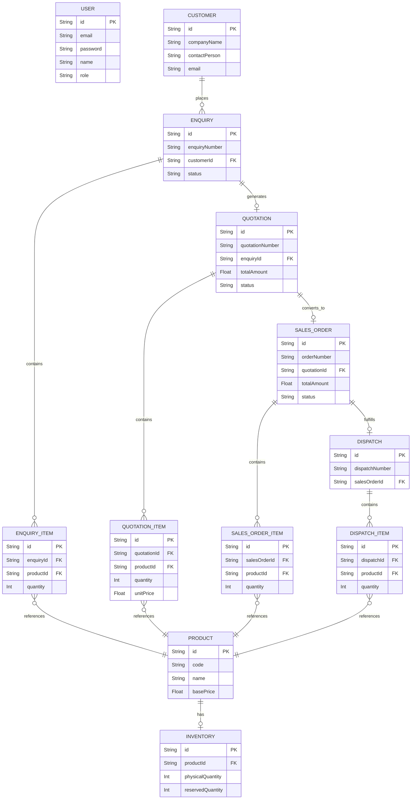

# Industrial ERP System

A full-stack, normalized relational ERP system designed to handle the core industrial workflow: `Enquiry → Quotation → Sales Order → Dispatch`. 

Built strictly following the technical requirements with proper backend-enforced validation, inventory reservation (with race-condition locking), and mathematical integrity.

## 🛠️ Tech Stack
- **Frontend:** Vanilla JavaScript (ES6+), HTML5, CSS3, Vite (Build Tool)
- **Backend:** Node.js, Express.js
- **Database:** Prisma ORM, SQLite (Provider-agnostic, ready for PostgreSQL)
- **Authentication:** JSON Web Tokens (JWT), bcryptjs
- **Testing:** Vitest, Supertest

---

## ⚙️ Environment Variables
The application requires a `.env` file in the `backend/` directory.

Create `backend/.env` with the following contents:
```env
PORT=5000
DATABASE_URL="file:./dev.db"
JWT_SECRET="industrial-erp-jwt-secret-key-2026"
NODE_ENV="development"
```
*(Note: If migrating to PostgreSQL, change the `DATABASE_URL` to a valid Postgres connection string).*

---

## 🚀 Project Setup & Database Configuration

### 1. Backend Setup & Seeding
Navigate to the backend directory and install dependencies:
```bash
cd backend
npm install
```

Run the database migrations to generate the SQLite database and seed it with test data (Users, Customers, Products):
```bash
npm run prisma:push
npm run seed
```

### 2. Frontend Setup
Navigate to the frontend directory and install dependencies:
```bash
cd ../frontend
npm install
```

---

## 💻 How to Run the Application

You will need two terminal windows to run both servers concurrently.

**Terminal 1 (Backend):**
```bash
cd backend
npm run dev
```
*Backend runs on http://localhost:5000*

**Terminal 2 (Frontend):**
```bash
cd frontend
npm run dev
```
*Frontend runs on http://localhost:3000*

---

## 🔑 Test Login Credentials

The `npm run seed` command automatically generates the following user accounts:

| Role | Email | Password |
|---|---|---|
| **Admin** | `admin@erp.com` | `admin123` |
| **Sales User** | `sales@erp.com` | `sales123` |

---

## 🧪 How to Run Tests

The backend includes a comprehensive, automated integration test suite (`vitest` + `supertest`) that verifies mathematical integrity, transaction locking, and role-based access.

To run the tests:
```bash
cd backend
npm run test
```

---

## 📊 Database Schema (ER Diagram)

The application utilizes a strictly normalized relational database.



---

## 📚 API Documentation

A complete Postman Collection is included in the repository root.

**File:** `Industrial_ERP_Postman_Collection.json`

To view the API documentation:
1. Open Postman.
2. Click **Import**.
3. Select the `Industrial_ERP_Postman_Collection.json` file from this repository.
4. The collection contains all REST endpoints (Auth, Products, Enquiries, Quotations, Sales Orders, Dispatches) pre-configured with sample payloads.
